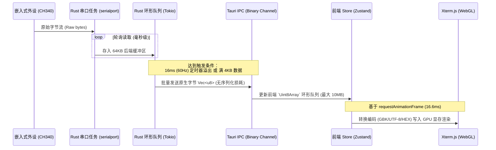
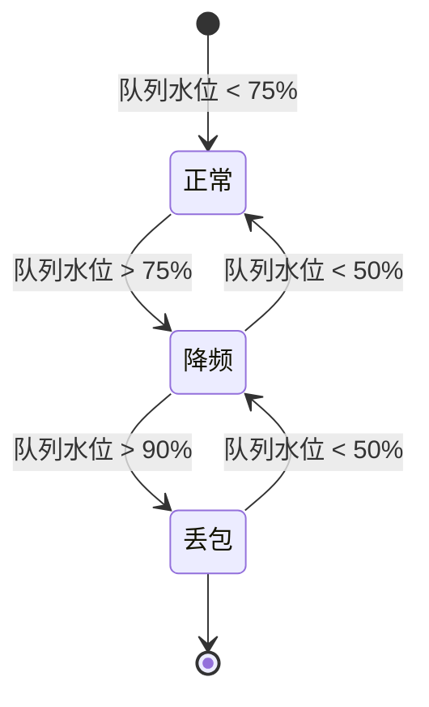

# OhMySerial 设计文档 (已优化)

**项目名称**：OhMySerial  
**技术栈**：Rust + Tauri 2.x + React + TypeScript + Xterm.js (WebGL)  
**目标平台**：Windows (Windows 10/11)  
**文档版本**：1.2
**日期**：2026-05-29

---

## 1. 项目概述

OhMySerial 是一款面向工业控制和嵌入式开发的高性能、轻量级串口调试助手，旨在作为传统 SSCOM 软件的现代化替代品。通过 **Rust 异步内核** 与 **WebGL 加速渲染** 的结合，完美解决传统工具在大数据量下卡死、不支持无损 HEX 切换、定时器不精准等核心痛点。

### 1.1 核心指标

| 指标       | 目标                             | 备注                                          |
| ---------- | -------------------------------- | --------------------------------------------- |
| 收发延迟   | < 1ms                            | 采用 Tokio 异步底层 + Windows 阻塞/非阻塞优化 |
| 渲染吞吐量 | 支持 921600 高波特率无卡顿       | Xterm.js (WebGL) 强力加速                     |
| 内存控制   | 空闲约 50MB，10MB 缓存下 < 150MB | Rust 二进制流无缝流转                         |
| 启动时间   | < 1.5 秒                         | 绿色单文件，秒开                              |
| 发布格式   | **Portable 免安装单文件**        | 编译为独立的 `OhMySerial.exe`                 |

---

## 2. 优化后的功能规格

### 2.1 串口基础操作

- **串口枚举**：基于 `serialport` 库自动扫描可用串口（支持 CH340, FTDI, CP210x 识别）。
- **参数控制**：波特率（110~921600及自定义）、数据位（5/6/7/8）、停止位（1/1.5/2）、校验位（无/奇/偶/MARK/SPACE）。
- **引脚控制**：支持手动拉高/拉低 DTR, RTS。
- **一键复位 (MCU Reset)**：提供预设 DTR/RTS 时序动作，一键复位 ESP32, ESP8266, Arduino 等单片机进入下载或运行状态。

### 2.2 发送功能

- **发送模式**：
  - **文本发送**：支持 **UTF-8** 与 **GBK** 两种编码。
    - UTF-8：前端使用原生 `TextDecoder` API
    - GBK：前端引入 `@js-icons/punycode` 或自实现 GBK→UTF-8 转换表
    - 编码检测失败时降级为 Latin-1（单字节安全映射）
  - HEX 发送：支持十六进制（例如 `31 32 33` 或紧凑型 `313233`），自动纠错及去空格。
- **换行符追加**：可选追加 `\r`, `\n`, `\r\n` 或无。
- **定时与循环发送**：
  - **后端高精度计时器**：定时任务下沉至 Rust 后端，采用 `tokio::time::interval`，实际精度受 Windows 调度器限制约为 1-15ms。
  - **前台防挂起**：不受 Windows 浏览器内核对后台标签页限流（Background Throttling）的影响，在软件最小化时依然精确发送。
- **预设命令面板**：命令管理列表，支持快捷键、点击发送、循环轮询发送队列。

### 2.3 接收功能与双缓冲渲染

- **底层无损存储**：
  - Rust 传给前端的必须是原始字节流 `Vec<u8>`。
  - 前端 Store 以 `Uint8Array` 存储，避免因为转换成 UTF-8 导致二进制非字符损坏（如 `0xFF` 变 ``）。
- **双缓冲更新 (Double Buffering)**：
  - **后端分批发送**：Rust 每收到数据写入 64KB 环形队列。满 4KB 或计时满 16ms 时触发一次 Tauri IPC 批量向前端发送，降低 IPC 损耗。
  - **前端合并更新**：使用 `requestAnimationFrame`（对应 60FPS），将收到的原始二进制批量打入渲染器。
- **WebGL 视图渲染**：
  - 使用 **Xterm.js (WebGL 渲染器)** 作为接收显示面板。
  - 支持 **HEX 视图**（行首地址 + 16 字节十六进制 + ASCII 字符对照）与 **文本视图**（支持 UTF-8 和 GBK）秒级无损切换。
- **搜索与过滤**：利用 Xterm.js 强大的检索组件，实现接收内容的高亮过滤和秒级搜索。
- **字节统计**：实时高精度统计 Tx / Rx 字节数。

### 2.4 数据存储

- 采用 **本地 JSON 存储**：
  - `config.json`：存储串口配置参数。
  - `presets.json`：存储用户预设命令列表。
  - `logs/`：自动分日期在后台记录原始串口收发历史到 `.log` 文件，写入采用缓冲写（BufWriter），完全不占用主线程。

---

## 3. UI/UX 设计 (现代简洁风格)

### 3.1 主界面布局

```
┌─────────────────────────────────────────────────────────────────┐
│ [🚀 OhMySerial] (Windows 10/11)               [🎨 主题] [📖 ASCII] │  ← 现代化标题栏
├─────────────────────────────────────────────────────────────────┤
│ 串口:[▼ COM3 (CH340)] 波特率:[▼ 115200] 参数:[▼ 8,N,1] [打开串口] │  ← 串口工具栏
├─────────────────────────────────────────────────────────────────┤
│                                                                 │
│  ┌─────────────────────────────────────────────────────────┐    │
│  │                                                         │    │
│  │                 Xterm.js (WebGL) 渲染面板                │    │  ← 核心接收区
│  │                                                         │    │
│  └─────────────────────────────────────────────────────────┘    │
│                                                                 │
├─────────────────────────────────────────────────────────────────┤
│ 编码:[● UTF-8  ○ GBK]  视图:[● 文本  ○ HEX]  流控:[✓ RTS] [✓ DTR]│  ← 状态和功能切换
├─────────────────────────────────────────────────────────────────┤
│ ┌──────────────────────────────────────┐ [定时] [ 100 ] ms      │
│ │ 文本或十六进制发送区域 (支持高亮提示)  │ [循环] [1000] 次      │  ← 发送操作栏
│ └──────────────────────────────────────┘ [  发  送  ]            │
├─────────────────────────────────────────────────────────────────┤
│ 预设多命令面板 (支持轮询队列)                     [+] 添加命令   │
│ ┌─────────────────────────────────────────────────────────────┐ │
│ │ [✓] 1. 握手命令  [HEX] 01 03 00 00 00 01 84 0A      [一键发送] │ │
│ │ [ ] 2. 查询温度  [TXT] GET_TEMP                     [一键发送] │ │
│ └─────────────────────────────────────────────────────────────┘ │
└─────────────────────────────────────────────────────────────────┘
```

### 3.2 色彩主题设计

| 元素          | 深色主题 (Dark Mode)    | 浅色主题 (Light Mode) |
| ------------- | ----------------------- | --------------------- |
| 主背景        | `#111827` (Slate 900)   | `#F9FAFB` (Gray 50)   |
| 输入/命令背景 | `#1F2937` (Slate 800)   | `#FFFFFF`             |
| 主文本        | `#F3F4F6` (Gray 100)    | `#111827` (Gray 900)  |
| 发送文本着色  | `#34D399` (Emerald 400) | `#059669`             |
| 接收文本着色  | `#FBBF24` (Amber 400)   | `#D97706`             |
| 强调色/主按钮 | `#3B82F6` (Blue 500)    | `#2563EB`             |

---

## 4. 核心架构设计

### 4.1 全链路二进制通信时序图



### 4.2 数据分层架构

由于 Xterm.js 默认缓冲只有约 10000 行，需要分层管理数据：

```
层1: 64KB 后端缓冲 (原始字节)
    ↓ IPC 批量发送
层2: 前端 Store (Uint8Array 可配置环形队列)
    支持 1MB / 5MB / 10MB / 50MB 四档可配置
    ↓
层3: 可见缓冲 (Xterm.js 约 10000 行)
    ↓
层4: 历史数据索引
    自动落盘到 logs/ 目录，按需加载
```

| 层级 | 存储位置  | 容量          | 说明                 |
| ---- | --------- | ------------- | -------------------- |
| 层1  | Rust 内存 | 64KB          | 原始字节，批量发送   |
| 层2  | 前端内存  | 可配置 1-50MB | Uint8Array 环形队列  |
| 层3  | GPU 显存  | 约 10000 行   | Xterm.js 可见区域    |
| 层4  | 磁盘      | 无限制        | logs/ 目录，按需加载 |

### 4.3 背压策略

当数据接收速度 > 前端消费速度时，自动触发背压机制：

1. **第一阶段（警告）**：后端检测到 64KB 队列超过 75% 水位时，降低刷新率（16ms → 32ms）。
2. **第二阶段（丢包通知）**：队列超过 90% 水位时，丢弃最旧数据，向前端发送 `overflow` 事件，前端显示警告提示：`"数据溢出，已丢 X 字节"` 。
3. **恢复**：当队列水位降至 50% 以下时，自动恢复正常刷新率。



### 4.4 自定义日志文件

用户可以将串口数据保存到自定义文件：

| 选项     | 说明                              |
| -------- | --------------------------------- |
| 文件路径 | 用户通过文件选择对话框指定        |
| 格式     | HEX 文本 / 原始二进制 二选一      |
| 写入方式 | 缓冲写（BufWriter），不阻塞主线程 |
| 模式     | 仅发送 / 仅接收 / 收发混合        |

### 4.5 发送队列架构

发送队列完整下沉到 Rust 后端执行：

```
前端                          Rust 后端
─────────────────────────────────────────────────
[发送开始命令] ──IPC────────→ [启动定时器]
[发送停止命令] ──IPC────────→ [停止定时器]
[配置轮询参数] ──IPC────────→ [更新队列配置]
     ↑
  仅负责发送开始/停止/配置
```

**轮询执行**：Rust 内部按配置的时间间隔独立执行，前端可随时停止。

**优先级机制**：每个预设命令携带权重字段（1-100），高权重命令优先发送。权重相同时按顺序执行。

```rust
// 后端高精度循环发送任务
pub async fn start_precise_sender(
    port_writer: Arc<Mutex<Box<dyn SerialPort>>>,
    payload: Vec<u8>,
    interval_ms: u64
) {
    let mut interval = tokio::time::interval(Duration::from_millis(interval_ms));
    // 采用 MissedTickBehavior::Delay，防止线程被系统刮起恢复后疯狂补发命令
    interval.set_missed_tick_behavior(tokio::time::MissedTickBehavior::Delay);

    loop {
        interval.tick().await;
        let mut writer = port_writer.lock().await;
        if let Err(e) = writer.write_all(&payload) {
            eprintln!("高精度发送失败: {:?}", e);
            break;
        }
    }
}
```

---

## 5. 免安装 Portable 版本打包策略

Tauri 2.x 默认构建会输出 `.msi` 安装包。为实现免安装单文件 `OhMySerial.exe` 的便携版输出：

1. **修改 `tauri.conf.json`**：
   ```json
   {
     "bundle": {
       "active": true,
       "targets": ["nsis"] // 使用 nsis 替代 msi，以支持生成单文件 exe
     }
   }
   ```
2. **NSIS 配置单文件打包**：
   通过配置 NSIS 参数，使编译器直接打包输出绿色免安装的独立 `.exe` 文件。该 exe 运行时会自动解压运行环境至临时目录，关闭后清理，保障纯净度。
3. **体积压缩优化**：
   - 启用 Rust 的 `lto = true`（链接时优化）和 `opt-level = "z"`（体积最小化）。
   - 在前端移除不必要的依赖，保持打包体积在 **12MB** 以内。

---

## 7. 错误处理策略

### 7.1 串口错误处理

| 场景         | 检测方式                         | 处理策略                                 |
| ------------ | -------------------------------- | ---------------------------------------- |
| 串口断开     | `serialport::Error::Io` 类型判断 | 通知前端更新 UI 状态为"已断开"，提示用户 |
| 设备拔出     | Windows `DEV_BREAK` 或心跳超时   | 同上，触发自动重连流程                   |
| 奇偶校验错误 | serialport 状态标志              | 记录到日志（不显示在界面），继续接收     |
| 发送超时     | `write_timeout` 触发             | 返回错误给前端，显示 `"发送失败: 超时"`  |
| 缓冲区溢出   | 后端队列 90% 水位                | 触发背压丢包策略                         |

### 7.2 自动重连机制

串口断开后自动重连：

```
断开 → 每 1s 检测串口是否恢复
       ↓
   是否恢复？──否→ 继续检测，累计超时 > 30s？
       ↓是                      ↓是
   自动重连 → 成功 → 通知前端  放弃 → 提示手动重连
```

### 7.3 多实例冲突处理

使用串口路径文件锁防止多实例占用同一串口：

| 文件位置                      | 说明                         |
| ----------------------------- | ---------------------------- |
| `{exe同目录}/locks/COM3.lock` | 串口被占用时创建，关闭时删除 |

**检测逻辑**：

1. 尝试打开串口前，检查 `locks/{port_name}.lock` 是否存在
2. 若存在且进程存活，提示用户"COM3 已被其他程序占用"
3. 若存在但进程已退出，删除锁文件并继续

### 7.4 配置文件损坏处理

| 场景              | 处理策略                                               |
| ----------------- | ------------------------------------------------------ |
| config.json 损坏  | 使用默认配置，提示用户"配置已重置"                     |
| presets.json 损坏 | 使用空预设列表，提示用户"预设已重置"                   |
| 便携模式标识      | 检查 exe 同目录是否有 `portable.ini`，有则采用相对路径 |

---

## 8. 配置热生效策略

部分参数在串口打开状态下修改时，无需关闭串口即可生效：

| 参数                  | 修改时行为                                              |
| --------------------- | ------------------------------------------------------- |
| 波特率                | 自动断开并以新参数重连串口                              |
| 数据位/停止位/校验位  | 同上                                                    |
| DTR/RTS               | 实时生效（调用 `serialport::SerialPort::write_dtr/rts`) |
| 编码选择（UTF-8/GBK） | 下次接收时生效，已接收数据保持原编码                    |
| HEX/文本视图切换      | 即时生效（从 Store 重新解码渲染）                       |

---

## 9. 后续实施路线

1. **[第一阶段] 环境初始化**：使用 `cargo tauri init` 初始化项目，配置 `serialport` 和 `tokio` 依赖。
2. **[第二阶段] Rust 串口驱动与 IPC 优化**：完成高精度的异步串口读写、批量分发逻辑。
3. **[第三阶段] 前端 Xterm.js 与编码层开发**：集成 Xterm.js 并增加 GBK 库，打通二进制双通道。
4. **[第四阶段] 预设及高级发送控制**：开发定时发送、高精度队列。
5. **[第五阶段] 打包发布**：打包配置单文件 `OhMySerial.exe`。
